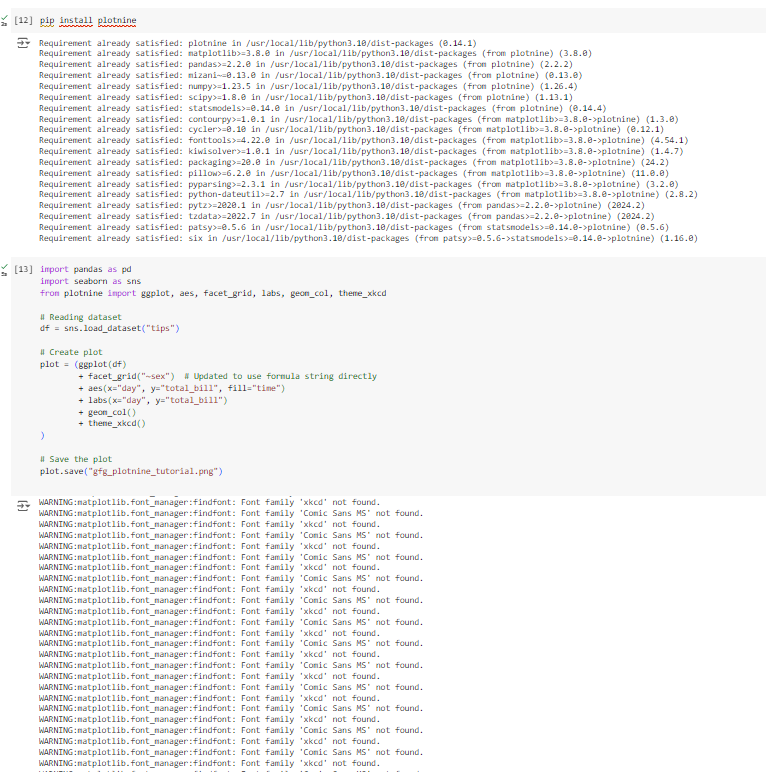

# Exno 4:APPDS
## NAME: SREEVALSAN
## REGISTER NO: 212223240158
## Aim:
      To Implement Advanced Visualizations and Geospatial Data using python.
## Algorithm:

Step 1: Include the necessary libraries

Step 2: Add the necessary values to the initialized variables.

Step 3: Install the advanced python necessary libraries such as pygal,plotnine,altair etc. 

Step 4: Use the necessary arguments for the functions used from advanced library

Step 5: Import Geopandas and folium

Step 6: Use folium map function to display the map location

## Coding & Output:

## Result:
    We have sucessfully performed advanced visualisation using geospatial data using python.